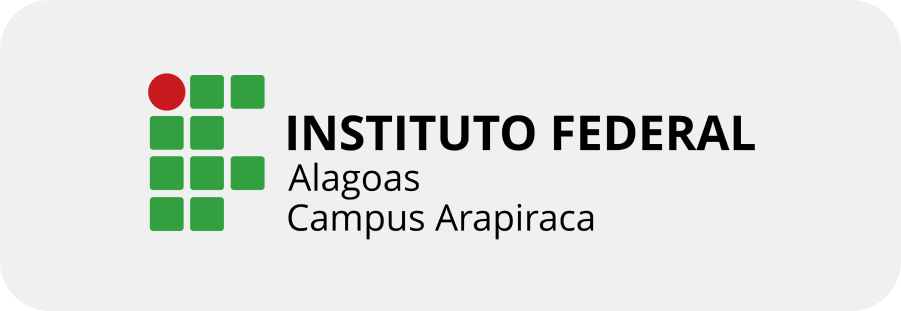

<a href="../README.md"><- Voltar</a>

				     
**Alunos: Allan Barbosa e Jaelson**
**Disciplina: Programação Web**            

### Atividade 1

#### 1. Teoria dos Frameworks
##### - Entender o que é e destacar a sua importância.

**R.** Um framework pode ser definido como um ‘software parcialmente completo’, e através dele se tem acesso a bibliotecas, componentes e ferramentas que irão fazer parte do desenvolvimento da aplicação.

#### 2. Estudo de Caso
##### - Identificar o estudo de caso e as suas contribuições.

**R.** O estudo de caso teve como base o portal corporativo ‘Portal do gestor’ da Universidade Federal de Alagoas (UFAL).
Suas contribuições partem da análise do portal, e a partir deste ponto, uma busca por pontos de melhorias para o portal. Com isso, a perspectiva deixada em pauta, foi a agregação de funcionalidade de Business Intelligence, a implementação de Data Marts e outras implementações de serviço, tudo para ampliar e facilitar o uso do portal pelos Gestores.

#### 3. Fazer a Análise Comparativa com o Portal do IFAL
##### Fazer o levantamento das áreas de conhecimento.

**R.** Pontos levantados da comparação entre o Portal IFAL e Portal UFAL.
Na Home de ambos os portais, UFAL possui divisão de conteúdos por ‘categorias’ como ‘Estudante’ e ‘‘servidor’ em que ambos possuem distinção com cores, o que facilita na localização de funções e informações, enquanto o portal do IFAl possui as opções em uma bandeja lateral, o que não é tão eficiente na busca de um item específico
Na seção de ‘Notícias’ do IFAL, as notícias são espalhadas sem qualquer distinção entre elas, enquanto na UFAL as notícias são separadas por cor em colunas, e também possuem a data de publicação.
Em relação aos Cursos apresentados em ambos os portais, podemos notar que no portal IFAL a página de cursos inclui todos os cursos que apesar de estarem separados por categorias, estão empilhados sem muita organização ou separação intuitiva entre eles. Enquanto no portal UFAL os cursos são separados por páginas como ‘Graduação’, ‘Pós-graduação’, etc. em que neles também possuem uma separação por campus.

#### 4. Identificar as tecnologias utilizadas
##### - De acordo com o que foi disponibilizado no arquivo sobre estudo e avaliação de frameworks, tentar identificar as tecnologias necessárias e utilizadas para a construção do Portal do IFAL.

**R.** Segue algumas identificadas:
Plone
BootStrap
JavaScript
Python

#### 5. Destacar as vantagens do uso de Sistemas Gerenciadores de Conteúdo.

**R.**
Flexibilidade no uso de informações.
Facilita a manutenção das informações.
Melhoria de segurança.
Facilita a tarefa de publicar informações na web;
Facilita o gerenciamento das informações.
Permite a restauração de dados antigos.
